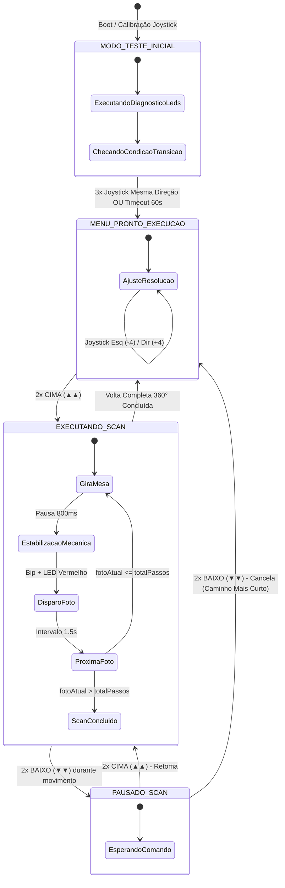

# RELATÓRIO TÉCNICO E ACADÊMICO DE PROJETO FINAL

**DISCIPLINA:** Internet das Coisas (IoT) / Sistemas Embarcados  
**PROJETO:** Sistema Automatizado de Digitalização 3D e Fotogrametria  
**PLATAFORMA:** ESP32 NodeMCU-32S (Xtensa Dual-Core 32-bit)  
**DATA DE ENTREGA:** 05 de Outubro de 2026  

---

## SUMÁRIO
1. [Descrição Geral da Aplicação](#1-descrição-geral-da-aplicação)
   - 1.1 Contextualização e Definição do Problema
   - 1.2 Objetivos do Projeto (Geral e Específicos)
   - 1.3 Motivação e Sustentabilidade (Upcycling de E-Lixo)
2. [Desenho da Arquitetura do Sistema](#2-desenho-da-arquitetura-do-sistema)
   - 2.1 Arquitetura em Camadas
   - 2.2 Diagrama de Blocos Funcionais
   - 2.3 Máquina de Estados Finitos (FSM)
   - 2.4 Algoritmo do Caminho Mais Curto (Shortest Angular Path)
3. [Relação de Partes e Materiais (BOM)](#3-relação-de-partes-e-materiais-bom)
4. [Diagrama de Conexão dos Componentes Eletrônicos](#4-diagrama-de-conexão-dos-componentes-eletrônicos)
   - 4.1 Pinout Geral do ESP32 (30 Pinos)
   - 4.2 Topologia Elétrica e Distribuição de Potência
   - 4.3 Tabela de Conexões Ponto a Ponto
5. [Código-Fonte Embarcado Completo](#5-código-fonte-embarcado-completo)
6. [Roteiro de Apresentação e Demonstração (15 Minutos)](#6-roteiro-de-apresentação-e-demonstração-15-minutos)

---

## 1. DESCRIÇÃO GERAL DA APLICAÇÃO

### 1.1 Contextualização e Definição do Problema
A **fotogrametria digital** é uma técnica científica e computacional que permite reconstruir malhas tridimensionais densas (`.OBJ` / `.STL`) com texturas fotorrealistas a partir de um conjunto de fotografias bidimensionais sobrepostas de um objeto real. 

No entanto, o processo manual de captura apresenta três gargalos críticos que comprometem a qualidade final da nuvem de pontos:
1. **Inconsistência no Espaçamento Angular:** A rotação manual do objeto introduz ângulos irregulares entre as fotos, gerando "buracos" na reconstrução.
2. **Vibrações e Desfoque de Movimento (Motion Blur):** Movimentos contínuos ou sem tempo adequado de amortecimento geram fotos borradas.
3. **Erros de Centralização:** Objetos fora do eixo central de rotação sofrem distorções de perspectiva e paralaxe.

O **Sistema Automatizado de Digitalização 3D** soluciona integralmente esses problemas através de uma mesa giratória mecatrônica de alta precisão angular, controlada pelo microcontrolador **ESP32**, equipada com mira laser de alinhamento óptico, interface LCD 16x2 I2C, controle analógico por joystick, sinalizadores audiovisuais e máquina de estados para execução, pausa e cancelamento inteligente.

---

### 1.2 Objetivos do Projeto

* **Objetivo Geral:**  
  Projetar, construir e validar uma bancada mecatrônica automatizada de baixo custo para aquisição padronizada de imagens para fotogrametria 3D, controlada por ESP32.

* **Objetivos Específicos:**
  * Implementar controle de passo suave (*half-step* de 4096 passos/volta) com resolução de $0{,}087^\circ$ por passo.
  * Sincronizar pausas mecânicas de estabilização com alertas sonoros e ópticos no instante exato da captura.
  * Prover interface homem-máquina (IHM) rica e intuitiva via Display LCD 16x2 e Joystick analógico com auto-calibração no boot.
  * Implementar algoritmo cinemático inteligente de retorno à origem ($0^\circ$) pelo caminho angular mais curto (*Shortest Angular Path*).
  * Incorporar mira laser colimada para alinhamento e centralização milimétrica de peças antes da digitalização.

---

### 1.3 Motivação e Sustentabilidade (Upcycling de E-Lixo)

* **Sustentabilidade e Economia Circular:** O projeto aproveita a mecânica de precisão de leitores ópticos de CD/DVD descartados, aplicando engenharia reversa e upcycling de lixo eletrônico para criar o acoplamento do prato rotativo.
* **Custo Zero em Componentes:** Maximização do uso do kit didático da disciplina (ESP32, motor de passo, driver ULN2003, display I2C, LEDs, buzzer e joystick) sem gerar custos extras de aquisição.
* **Aplicação Prática e Científica:** Criação de uma ferramenta real e acessível para digitalização de peças para engenharia reversa, prototipagem rápida, impressão 3D e preservação de acervos culturais.

---

## 2. DESENHO DA ARQUITETURA DO SISTEMA

### 2.1 Arquitetura em Camadas

```
┌─────────────────────────────────────────────────────────────┐
│                 CAMADA DE APLICAÇÃO / USUÁRIO               │
│   • Display LCD 16x2 I2C (Feedback em Tempo Real)           │
│   • Joystick Analógico 2 Eixos (Navegação e Comandos)       │
│   • Sinalização Sonora (Buzzer) e Visual (6x LEDs em Funil) │
│   • Mira Laser de Alinhamento Óptico                        │
└──────────────────────────────┬──────────────────────────────┘
                               │
┌──────────────────────────────▼──────────────────────────────┐
│           CAMADA DE PROCESSAMENTO E CONTROLE (ESP32)        │
│   • Máquina de Estados Finitos (Standby, Menu, Scan, Pausa) │
│   • Auto-Calibração Dinâmica de Centro de Repouso (ADC1)    │
│   • Filtragem por Sobre-Amostragem de Sinal (16 Amostras)   │
│   • Algoritmo de Retorno Inteligente pelo Caminho Mais Curto│
└──────────────────────────────┬──────────────────────────────┘
                               │
┌──────────────────────────────▼──────────────────────────────┐
│             CAMADA DE ATUAÇÃO MECATRÔNICA DE POTÊNCIA       │
│   • Driver de Corrente ULN2003 (Array Darlington)           │
│   • Motor de Passo 28BYJ-48 (Redução 1:64 / 4096 Passos)    │
│   • Desenergização Térmica Automática de Bobinas em Repouso │
│   • Prato Giratório com Rolamento de CD/DVD Reaproveitado   │
└─────────────────────────────────────────────────────────────┘
```

---

### 2.2 Diagrama de Blocos Funcionais

```mermaid
flowchart TD
    subgraph ENERGIA ["⚡ Sistema de Alimentação"]
        USB["Fonte USB 5V (ESP32 / Lógica)"]
        EXT["Fonte Externa 5V (Motor ULN2003)"]
        GND["Barramento de GND Unificado"]
        USB --- GND
        EXT --- GND
    end

    subgraph ENTRADAS ["🕹️ Entradas e Sensores"]
        JOY["Joystick Analógico 2 Eixos\n(VRX -> VP / VRY -> VN)"]
    end

    subgraph PROCESSADOR ["🧠 Nó Central de Processamento"]
        ESP["ESP32 NodeMCU-32S\n(Dual Core 240MHz)"]
    end

    subgraph SAIDAS_IHM ["🖥️ Interface com o Usuário"]
        LCD["Display LCD 16x2 I2C\n(SDA: D21 / SCL: D22)"]
        LEDS["6x LEDs de Estado\n(Verdes: 26, Amarelos: 27, Vermelhos: 14)"]
        BUZZ["Buzzer Piezoelétrico\n(GPIO 25)"]
        LASER["Mira Laser Vermelho\n(GPIO 33)"]
    end

    subgraph ATUACAO ["⚙️ Atuação Mecatrônica"]
        DRV["Driver ULN2003\n(IN1: 19, IN2: 18, IN3: 5, IN4: 17)"]
        MOT["Motor de Passo 28BYJ-48\n(4096 Passos / Volta)"]
        MESA["Mesa Giratória 360°"]
    end

    JOY -->|Sinais Analógicos ADC1| ESP
    ESP -->|Barramento I2C| LCD
    ESP -->|Controle Digital| LEDS
    ESP -->|PWM / Tons| BUZZ
    ESP -->|Ativação Óptica| LASER
    ESP -->|Sinais de Passo (Half-Step)| DRV
    DRV -->|Corrente de Bobinas| MOT
    MOT -->|Tração Mecânica| MESA
```

---

### 2.3 Máquina de Estados Finitos (FSM)



---

### 2.4 Algoritmo do Caminho Mais Curto (Shortest Angular Path)

Caso o usuário cancele uma digitalização durante a pausa, o firmware não força uma volta completa desnecessária nem um rebobinamento cego. Ele calcula a menor distância angular euclidiana para o retorno ao Ponto Zero:

$$\text{Passos Restantes} = 4096 - \text{Passos Acumulados}$$

$$\text{Decisão de Retorno} = \begin{cases} 
\text{Avanço Horário (+\text{Passos Restantes})}, & \text{se } \text{Passos Acumulados} > 2048 \ ( > 180^\circ) \\
\text{Rebobinamento Anti-Horário (-\text{Passos Acumulados})}, & \text{se } \text{Passos Acumulados} \le 2048 \ (\le 180^\circ)
\end{cases}$$

Ao alcançar a posição $0^\circ$, o motor é **imediatamente desenergizado**, prevenindo aquecimento estático nas bobinas.

---

## 3. RELAÇÃO DE PARTES E MATERIAIS (BOM)

| Item | Categoria | Descrição do Componente / Especificação | Qtd. | Função no Sistema |
| :---: | :--- | :--- | :---: | :--- |
| **1** | Processamento | **Placa ESP32 NodeMCU-32S** (Xtensa Dual-Core 240MHz, 30 pinos) | 1 un. | Núcleo de processamento em tempo real e controle cinemático. |
| **2** | Atuação | **Motor de Passo Unipolar 28BYJ-48** (5V DC, Redução 1:64) | 1 un. | Executa giros discretos com resolução de 4096 passos/volta. |
| **3** | Potência | **Módulo Driver ULN2003** (Array de transistores Darlington) | 1 un. | Chaveamento de alta corrente para as 4 bobinas do motor. |
| **4** | IHM / Display | **Display LCD 16x2 com Módulo Adaptador I2C (PCF8574)** | 1 un. | Exibe fotos atuais, ângulo de rotação e menus de operação. |
| **5** | IHM / Entrada | **Módulo Joystick Analógico 2 Eixos** (Potenciômetros 10k) | 1 un. | Navegação, ajuste de resolução e comandos de início/pausa/cancelamento. |
| **6** | Mira Óptica | **Módulo Diodo Laser Vermelho 650nm** (Upcycled / Nerf) | 1 un. | Mira óptica para centralização geométrica da peça na mesa. |
| **7** | Sinalização Sonora| **Buzzer Piezoelétrico Ativo/Passivo 5V** | 1 un. | Alertas sonoros de início, estabilização, disparo e fim de ciclo. |
| **8** | Sinalização Óptica| **6x LEDs de 5mm** (2 Verdes, 2 Amarelos, 2 Vermelhos em "Funil") | 6 un. | Indicação visual: Verde (Pronto), Amarelo (Girando/Pausa), Vermelho (Foto). |
| **9** | Proteção | **Resistores de Película de Carbono 300 $\Omega$ / 1/4W** | 4 un. | Limitação de corrente para os LEDs e para o Diodo Laser. |
| **10**| Montagem | **Protoboard de 800 Pontos + Protoboard de 400 Pontos** | 2 un. | Distribuição de sinais e barramentos de alimentação de bancada. |
| **11**| Mecânica | **Estrutura Mecânica de Leitor de CD/DVD (Upcycling)** | 1 un. | Rolamento de precisão e suporte mecânico de baixo atrito para a mesa. |
| **12**| Conectores | **Cabos Jumpers Flexíveis Macho-Macho e Macho-Fêmea** | 25 un.| Interconexão elétrica entre a placa, protoboard e atuadores. |
| **13**| Alimentação | **Fonte de Alimentação Externa 5V / 2A + Cabo USB** | 1 un. | Alimentação do driver do motor e do ESP32 com GND unificado. |

---

## 4. DIAGRAMA DE CONEXÃO DOS COMPONENTES ELETRÔNICOS

### 4.1 Pinout do Microcontrolador ESP32 (30 Pinos)

```
                            ┌────────────────┐
                            │  ESP32 30-PIN  │
                     EN ────┤ 1           30 ├──── D23 (MOSI)
      (Joy VRX) GPIO 36 (VP) ────┤ 2           29 ├──── D22 (I2C SCL) ───► LCD SCL
      (Joy VRY) GPIO 39 (VN) ────┤ 3           28 ├──── TX0
                GPIO 34 ────┤ 4           27 ├──── RX0
                GPIO 35 ────┤ 5           26 ├──── D21 (I2C SDA) ───► LCD SDA
    (Mira Laser) GPIO 33 ────┤ 6           25 ├──── D19 (IN1) ──────► ULN2003 IN1
                GPIO 32 ────┤ 7           24 ├──── D18 (IN2) ──────► ULN2003 IN2
    (LEDs Verm) GPIO 14 ────┤ 8           23 ├──── D5  (IN3) ──────► ULN2003 IN3
    (LEDs Amar) GPIO 27 ────┤ 9           22 ├──── TX2 (IN4) ──────► ULN2003 IN4
    (LEDs Verd) GPIO 26 ────┤ 10          21 ├──── RX2
        (Buzzer) GPIO 25 ────┤ 11          20 ├──── D4
                GPIO 12 ────┤ 12          19 ├──── D2
                GPIO 13 ────┤ 13          18 ├──── D15
                    GND ────┤ 14          17 ├──── GND ───────────► GND COMUM
                    VIN ────┤ 15          16 ├──── 3V3 ───────────► VCC Joystick (3.3V)
                            └────────────────┘
```

---

### 4.2 Topologia Elétrica e Distribuição de Potência

* **Alimentação da Lógica (3.3V):** O ESP32 e os potenciômetros do Joystick são alimentados pelo regulador interno de 3.3V (`3V3`). Isso evita saturação do ADC e leituras instáveis.
* **Alimentação de Potência (5V Externa):** O Driver ULN2003 e o Display LCD operam em 5V. O barramento de potência externa de 5V alimenta o pino `+` do ULN2003.
* **GND Comum Obrigatório:** O polo negativo da fonte externa de 5V é conectado diretamente ao barramento de `GND` do ESP32, garantindo que os pulsos lógicos de `IN1..IN4` tenham a mesma referência de tensão.

---

### 4.3 Tabela de Conexões Ponto a Ponto

| Componente | Pino do Componente | Pino no ESP32 | Descrição / Observação |
| :--- | :--- | :--- | :--- |
| **Display LCD 16x2** | SDA | **GPIO 21 (D21)** | Barramento I2C de Dados (Endereço `0x27`) |
| **Display LCD 16x2** | SCL | **GPIO 22 (D22)** | Barramento I2C de Clock |
| **Display LCD 16x2** | VCC / GND | **VIN (5V) / GND** | Alimentação do controlador e backlight |
| **Driver ULN2003** | IN1 | **GPIO 19 (D19)** | Bobina A do Motor de Passo |
| **Driver ULN2003** | IN2 | **GPIO 18 (D18)** | Bobina B do Motor de Passo |
| **Driver ULN2003** | IN3 | **GPIO 5 (D5)** | Bobina C do Motor de Passo |
| **Driver ULN2003** | IN4 | **GPIO 17 (TX2)**| Bobina D do Motor de Passo |
| **Driver ULN2003** | (+) / (-) | **Fonte 5V / GND**| Potência externa com jumper de alimentação ligado |
| **Joystick Analógico**| VRX | **GPIO 36 (VP)** | Eixo X (Leitura ADC1_CH0 filtrada) |
| **Joystick Analógico**| VRY | **GPIO 39 (VN)** | Eixo Y (Leitura ADC1_CH3 filtrada) |
| **Joystick Analógico**| VCC / GND | **3V3 / GND** | Tensão regulada para máxima precisão de leitura |
| **Mira Laser** | Positivo (+) | **GPIO 33 (D33)** | Via resistor limitador de $300\ \Omega$ |
| **Mira Laser** | Negativo (-) | **GND** | Retorno de corrente |
| **LEDs Verdes (2x)** | Anodo (+) | **GPIO 26 (D26)** | Ligados em paralelo com resistores individuais |
| **LEDs Amarelos (2x)**| Anodo (+) | **GPIO 27 (D27)** | Ligados em paralelo com resistores individuais |
| **LEDs Vermelhos (2x)**| Anodo (+) | **GPIO 14 (D14)** | Ligados em paralelo com resistores individuais |
| **Buzzer Piezo** | Positivo (+) | **GPIO 25 (D25)** | Sinal PWM de frequência sonora |
| **Buzzer Piezo** | Negativo (-) | **GND** | Retorno de terra |

---

## 5. CÓDIGO-FONTE EMBARCADO COMPLETO

O código-fonte em C++ / Arduino Framework foi desenvolvido com foco em estabilidade operacional, baixo consumo elétrico e máxima fluidez na experiência do usuário.

```cpp
#include <Arduino.h>
#include <Wire.h>
#include <LiquidCrystal_I2C.h>

/*
 * =========================================================================
 *  SISTEMA AUTOMATIZADO DE DIGITALIZAÇÃO 3D E FOTOGRAMETRIA
 *  PROJETO FINAL DE IOT / SISTEMAS EMBARCADOS
 * =========================================================================
 */

// ================= PINAGEM DO HARDWARE =================
const int PIN_JOY_X      = 36; // GPIO36 (VP) - Eixo Horizontal
const int PIN_JOY_Y      = 39; // GPIO39 (VN) - Eixo Vertical

const int PIN_BUZZER     = 25; // Buzzer Piezoelétrico
const int PIN_LASER      = 33; // Mira Laser (GPIO 33 / D33)

const int PIN_LED_VERDE  = 26; // 2x LEDs Verdes
const int PIN_LED_AMAR   = 27; // 2x LEDs Amarelos
const int PIN_LED_VERM   = 14; // 2x LEDs Vermelhos

const int PIN_IN1        = 19; // Driver ULN2003 - IN1
const int PIN_IN2        = 18; // Driver ULN2003 - IN2
const int PIN_IN3        = 5;  // Driver ULN2003 - IN3
const int PIN_IN4        = 17; // Driver ULN2003 - IN4 (TX2)

LiquidCrystal_I2C lcd(0x27, 16, 2);

// Matriz de meio-passo suave (4096 passos por volta completa)
const int PASSOS_VOLTA_COMPLETA = 4096;
const int passosMatriz[8][4] = {
  {1, 0, 0, 0}, {1, 1, 0, 0}, {0, 1, 0, 0}, {0, 1, 1, 0},
  {0, 0, 1, 0}, {0, 0, 1, 1}, {0, 0, 0, 1}, {1, 0, 0, 1}
};
int indicePasso = 0;

enum EstadoGlobal {
  MODO_TESTE_INICIAL,
  MENU_PRONTO_EXECUCAO,
  EXECUTANDO_SCAN,
  PAUSADO_SCAN
};
EstadoGlobal estadoAtual = MODO_TESTE_INICIAL;

enum ComandoJoy {
  JOY_NONE,
  JOY_UP,
  JOY_DOWN,
  JOY_LEFT,
  JOY_RIGHT
};

int totalPassos = 24;
int fotoAtual = 1;
long passosAcumulados = 0;
int anguloAtual = 0;

// Temporização de Inicialização
unsigned long tempoInicioBoot = 0;
const unsigned long TEMPO_LIMITE_TESTE_MS = 60000; // 1 minuto

// Detecção de 3 movimentos repetidos no modo teste
ComandoJoy ultimoComandoTeste = JOY_NONE;
int contagemComandosRepetidos = 0;
unsigned long tempoUltimoComandoTeste = 0;

// Detecção de Duplo Toque (2x CIMA / 2x BAIXO)
unsigned long tempoPrimeiroToque = 0;
int toquesCima = 0;
int toquesBaixo = 0;
const unsigned long JANELA_DUPLO_TOQUE = 600; // ms

// Calibração do Joystick
int centroJoyX = 2048;
int centroJoyY = 2048;

// Protótipos de Funções
void definirLeds(bool vermelho, bool amarelo, bool verde);
void desenergizarMotor();
void moverMotor(long passos, int delayMicros = 1300);
void bipCurto();
void bipFoto();
void bipFimCiclo();
int lerAnalogicoFiltrado(int pino);
void calibrarCentroJoystick();
ComandoJoy lerJoystick();
void ativarModoExecucao();
void atualizarTelaMenu();
bool checarDuploBaixoParaPausa(int tempoEsperaMs);
void gerenciarComandosPausa();
void retornarAoPontoZeroMenorDistancia();
void executarCicloLedsTeste();

void setup() {
  Serial.begin(115200);
  delay(200);

  tempoInicioBoot = millis();
  Serial.println("\n=======================================================");
  Serial.println("   SISTEMA DE DIGITALIZACAO 3D - MODO ALTA ESTABILIDADE  ");
  Serial.println("=======================================================");

  pinMode(PIN_BUZZER, OUTPUT);
  pinMode(PIN_LASER, OUTPUT);
  pinMode(PIN_LED_VERDE, OUTPUT);
  pinMode(PIN_LED_AMAR, OUTPUT);
  pinMode(PIN_LED_VERM, OUTPUT);

  pinMode(PIN_IN1, OUTPUT);
  pinMode(PIN_IN2, OUTPUT);
  pinMode(PIN_IN3, OUTPUT);
  pinMode(PIN_IN4, OUTPUT);

  desenergizarMotor();
  definirLeds(LOW, LOW, LOW);
  digitalWrite(PIN_LASER, HIGH); // Liga mira laser para centralização

  // Inicializa Display LCD 16x2 I2C
  Wire.begin(21, 22);
  lcd.init();
  lcd.backlight();
  lcd.clear();
  lcd.setCursor(0, 0);
  lcd.print("SCANNER 3D IOT");
  lcd.setCursor(0, 1);
  lcd.print("Calibrando Joy..");

  calibrarCentroJoystick();

  lcd.clear();
  lcd.setCursor(0, 0);
  lcd.print("MODO DE TESTE");
  lcd.setCursor(0, 1);
  lcd.print("3x Joy ou 60 seg");
  delay(800);
}

void loop() {
  ComandoJoy cmd = lerJoystick();

  // =========================================================================
  // ESTADO 1: MODO TESTE INICIAL
  // =========================================================================
  if (estadoAtual == MODO_TESTE_INICIAL) {
    digitalWrite(PIN_LASER, HIGH);

    // 1. Checa timeout de 1 minuto (60 segundos)
    unsigned long decorrido = millis() - tempoInicioBoot;
    if (decorrido >= TEMPO_LIMITE_TESTE_MS) {
      Serial.println(">> [MODO TESTE] 1 Minuto decorrido -> Entrando no Modo de Execucao!");
      ativarModoExecucao();
      return;
    }

    // 2. Checa 3 toques repetidos para a mesma direção
    if (cmd != JOY_NONE) {
      if (cmd == ultimoComandoTeste && (millis() - tempoUltimoComandoTeste < 1200)) {
        contagemComandosRepetidos++;
        bipCurto();
        Serial.printf(">> [MODO TESTE] Toque repetido (%d/3)!\n", contagemComandosRepetidos);

        if (contagemComandosRepetidos >= 3) {
          Serial.println(">> [MODO TESTE] 3 Toques confirmados -> Entrando no Modo de Execucao!");
          ativarModoExecucao();
          return;
        }
      } else {
        ultimoComandoTeste = cmd;
        contagemComandosRepetidos = 1;
        bipCurto();
        Serial.println(">> [MODO TESTE] Primeiro toque registrado (1/3)");
      }
      tempoUltimoComandoTeste = millis();
    }

    if (contagemComandosRepetidos > 0 && (millis() - tempoUltimoComandoTeste > 1200)) {
      contagemComandosRepetidos = 0;
      ultimoComandoTeste = JOY_NONE;
    }

    // Exibe contagem regressiva e status no LCD
    static unsigned long ultimoCicloVisual = 0;
    if (millis() - ultimoCicloVisual > 250) {
      ultimoCicloVisual = millis();
      int segundosRestantes = (TEMPO_LIMITE_TESTE_MS - decorrido) / 1000;

      lcd.setCursor(0, 0);
      lcd.print("TESTE: 3x -> EXEC");
      lcd.setCursor(0, 1);
      lcd.print("Auto: ");
      lcd.print(segundosRestantes);
      lcd.print("s (");
      lcd.print(contagemComandosRepetidos);
      lcd.print("/3)  ");
    }

    executarCicloLedsTeste();
    return;
  }

  // =========================================================================
  // ESTADO 2: MENU DE EXECUÇÃO (CONFIGURAÇÃO DE FOTOS E DISPARO)
  // =========================================================================
  if (estadoAtual == MENU_PRONTO_EXECUCAO) {
    definirLeds(LOW, LOW, HIGH); // Verde aceso (Pronto)
    digitalWrite(PIN_LASER, HIGH); // Mira laser acesa para posicionar o objeto

    // Ajuste de resolução: Direita (+4) / Esquerda (-4)
    if (cmd == JOY_RIGHT) {
      if (totalPassos < 36) {
        totalPassos += 4;
        bipCurto();
        atualizarTelaMenu();
      }
    } else if (cmd == JOY_LEFT) {
      if (totalPassos > 8) {
        totalPassos -= 4;
        bipCurto();
        atualizarTelaMenu();
      }
    }

    // 2 cliques seguidos para CIMA -> INICIA O SCAN 360°
    if (cmd == JOY_UP) {
      toquesCima++;
      if (toquesCima == 1) {
        tempoPrimeiroToque = millis();
        Serial.println(">> [MENU] 1x CIMA recebido. Pressione CIMA novamente para Iniciar!");
      } else if (toquesCima >= 2) {
        toquesCima = 0;

        Serial.println(">> [MENU] 2x CIMA Confirmado! INICIANDO DIGITALIZACAO 360°...");
        tone(PIN_BUZZER, 1800, 200);
        digitalWrite(PIN_LASER, LOW); // Apaga o laser nas fotos
        passosAcumulados = 0;
        fotoAtual = 1;
        estadoAtual = EXECUTANDO_SCAN;
      }
    }

    if (toquesCima > 0 && (millis() - tempoPrimeiroToque > JANELA_DUPLO_TOQUE)) {
      toquesCima = 0;
    }
  }

  // =========================================================================
  // ESTADO 3: EXECUTANDO DIGITALIZAÇÃO 360°
  // =========================================================================
  else if (estadoAtual == EXECUTANDO_SCAN) {
    digitalWrite(PIN_LASER, LOW); // Garante que o laser fica apagado nas fotos

    while (fotoAtual <= totalPassos) {
      // 1. Calcula o próximo ângulo e passos
      long posicaoAlvoPassos = round((fotoAtual - 1) * ((float)PASSOS_VOLTA_COMPLETA / totalPassos));
      long passosParaGirar = posicaoAlvoPassos - passosAcumulados;

      if (passosParaGirar > 0) {
        definirLeds(LOW, HIGH, LOW); // Amarelo (Girando mesa)
        lcd.clear();
        lcd.setCursor(0, 0);
        lcd.print("GIRANDO MESA...");
        lcd.setCursor(0, 1);
        lcd.print("Passo: +");
        lcd.print(passosParaGirar);
        lcd.print(" stp");

        moverMotor(passosParaGirar, 1300);
        passosAcumulados += passosParaGirar;
        desenergizarMotor();
      }

      // 2. Atualiza o LCD
      anguloAtual = round((passosAcumulados / (float)PASSOS_VOLTA_COMPLETA) * 360.0);
      lcd.clear();
      lcd.setCursor(0, 0);
      lcd.print("FOTO: ");
      lcd.print(fotoAtual);
      lcd.print("/");
      lcd.print(totalPassos);

      lcd.setCursor(0, 1);
      lcd.print("ANG: ");
      lcd.print(anguloAtual);
      lcd.print((char)223);
      lcd.print(" [CAPTURA]");

      // 3. Pausa de estabilização mecânica (800ms)
      definirLeds(LOW, HIGH, LOW);
      if (!checarDuploBaixoParaPausa(800)) return;

      // 4. Sinal de Captura da Foto (LED Vermelho + Bip)
      definirLeds(HIGH, LOW, LOW); // Vermelho (Momento da captura)
      bipFoto();
      Serial.printf(">> [CAPTURA FOTO %d/%d] Angulo: %d graus\n", fotoAtual, totalPassos, anguloAtual);

      // 5. Intervalo pós-disparo (1.5s)
      if (!checarDuploBaixoParaPausa(1500)) return;

      fotoAtual++;
    }

    // 6. Conclusão da Volta Completa de 360°
    if (passosAcumulados < PASSOS_VOLTA_COMPLETA) {
      long resto = PASSOS_VOLTA_COMPLETA - passosAcumulados;
      moverMotor(resto, 1300);
      passosAcumulados += resto;
    }
    desenergizarMotor();

    bipFimCiclo();
    definirLeds(LOW, LOW, HIGH);
    digitalWrite(PIN_LASER, HIGH); // Reativa mira laser

    lcd.clear();
    lcd.setCursor(0, 0);
    lcd.print("SCAN CONCLUIDO!");
    lcd.setCursor(0, 1);
    lcd.print("100% NO PONTO 0");
    delay(2500);

    passosAcumulados = 0;
    fotoAtual = 1;
    estadoAtual = MENU_PRONTO_EXECUCAO;
    atualizarTelaMenu();
  }

  // =========================================================================
  // ESTADO 4: PAUSADO
  // =========================================================================
  else if (estadoAtual == PAUSADO_SCAN) {
    definirLeds(LOW, HIGH, LOW); // Amarelo aceso (Pausa)
    digitalWrite(PIN_LASER, HIGH); // Liga laser na pausa para checagem
    desenergizarMotor();
    gerenciarComandosPausa();
  }
}

// ============= ATIVAÇÃO DO MODO DE EXECUÇÃO =============
void ativarModoExecucao() {
  Serial.println("\n>> [MODO DE EXECUCAO] Menu Ativado com Sucesso!");
  desenergizarMotor();
  definirLeds(LOW, LOW, HIGH);
  digitalWrite(PIN_LASER, HIGH);

  tone(PIN_BUZZER, 1600, 150);
  toquesCima = 0;
  toquesBaixo = 0;
  estadoAtual = MENU_PRONTO_EXECUCAO;
  atualizarTelaMenu();
}

// ============= CHECAGEM DE 2x BAIXO PARA PAUSA =============
bool checarDuploBaixoParaPausa(int tempoEsperaMs) {
  int fatias = tempoEsperaMs / 50;
  for (int i = 0; i < fatias; i++) {
    ComandoJoy cmd = lerJoystick();

    if (cmd == JOY_DOWN) {
      toquesBaixo++;
      Serial.printf(">> [EXECUCAO] Toque BAIXO para Pausa (%d/2)\n", toquesBaixo);
      if (toquesBaixo == 1) {
        tempoPrimeiroToque = millis();
      } else if (toquesBaixo >= 2) {
        toquesBaixo = 0;
        toquesCima = 0;
        tone(PIN_BUZZER, 800, 200);
        estadoAtual = PAUSADO_SCAN;

        lcd.clear();
        lcd.setCursor(0, 0);
        lcd.print(">> PAUSADO <<");
        lcd.setCursor(0, 1);
        lcd.print("^^Cont  | vvCanc");
        Serial.println(">> [EXECUCAO] 2x BAIXO detectado -> SISTEMA PAUSADO!");
        return false;
      }
    }

    if (toquesBaixo > 0 && (millis() - tempoPrimeiroToque > 1200)) {
      toquesBaixo = 0;
    }

    delay(50);
  }
  return true;
}

// ============= GERENCIAMENTO DE COMANDOS NA PAUSA =============
void gerenciarComandosPausa() {
  ComandoJoy cmd = lerJoystick();

  // 2x CIMA: DESPAUSAR E CONTINUAR
  if (cmd == JOY_UP) {
    toquesCima++;
    Serial.printf(">> [PAUSA] Toque CIMA recebido (%d/2)\n", toquesCima);
    if (toquesCima == 1) {
      tempoPrimeiroToque = millis();
    } else if (toquesCima >= 2) {
      toquesCima = 0;
      toquesBaixo = 0;
      Serial.println(">> [PAUSA] 2x CIMA -> DESPAUSANDO E RETOMANDO SCAN!");
      tone(PIN_BUZZER, 1400, 150);
      estadoAtual = EXECUTANDO_SCAN;
      return;
    }
  }

  // 2x BAIXO: CANCELAR COM CÁLCULO DE MENOR DISTÂNCIA
  if (cmd == JOY_DOWN) {
    toquesBaixo++;
    Serial.printf(">> [PAUSA] Toque BAIXO recebido (%d/2)\n", toquesBaixo);
    if (toquesBaixo == 1) {
      tempoPrimeiroToque = millis();
    } else if (toquesBaixo >= 2) {
      toquesBaixo = 0;
      toquesCima = 0;
      Serial.println(">> [PAUSA] 2x BAIXO -> CANCELANDO SCAN COM CAMINHO MAIS CURTO!");
      tone(PIN_BUZZER, 500, 300);
      retornarAoPontoZeroMenorDistancia();

      fotoAtual = 1;
      estadoAtual = MENU_PRONTO_EXECUCAO;
      atualizarTelaMenu();
      return;
    }
  }

  if (toquesCima > 0 && (millis() - tempoPrimeiroToque > 1200)) {
    toquesCima = 0;
  }
  if (toquesBaixo > 0 && (millis() - tempoPrimeiroToque > 1200)) {
    toquesBaixo = 0;
  }
}

// ============= ALGORITMO DO CAMINHO MAIS CURTO =============
void retornarAoPontoZeroMenorDistancia() {
  if (passosAcumulados > 0) {
    lcd.clear();
    lcd.setCursor(0, 0);
    lcd.print("RESET PONTO 0...");

    long passosRestantes = PASSOS_VOLTA_COMPLETA - passosAcumulados;

    if (passosAcumulados > (PASSOS_VOLTA_COMPLETA / 2)) {
      lcd.setCursor(0, 1);
      lcd.print("Avanco Rapido ->");
      Serial.printf(">> [RESET ZERO] Avanco rapido: +%ld passos\n", passosRestantes);
      moverMotor(passosRestantes, 1100);
    } else {
      lcd.setCursor(0, 1);
      lcd.print("<- Rebobinando");
      Serial.printf(">> [RESET ZERO] Rebobinando: -%ld passos\n", passosAcumulados);
      moverMotor(-passosAcumulados, 1100);
    }

    passosAcumulados = 0;
    desenergizarMotor();
  }
}

// ============= ATUALIZAÇÃO DA TELA DO MENU =============
void atualizarTelaMenu() {
  lcd.clear();
  lcd.setCursor(0, 0);
  lcd.print("MODO EXECUCAO :)");
  lcd.setCursor(0, 1);
  lcd.print("FOTOS: ");
  lcd.print(totalPassos);
  lcd.print(" (^^ GO)");
}

// ============= CICLO VISUAL DE LEDS NO TESTE =============
void executarCicloLedsTeste() {
  static unsigned long tempoLed = 0;
  static int faseLed = 0;

  if (millis() - tempoLed > 400) {
    tempoLed = millis();
    faseLed = (faseLed + 1) % 4;

    switch (faseLed) {
      case 0: definirLeds(LOW, LOW, HIGH); break; // Verde
      case 1: definirLeds(LOW, HIGH, LOW); break; // Amarelo
      case 2: definirLeds(HIGH, LOW, LOW); break; // Vermelho
      case 3: definirLeds(HIGH, HIGH, HIGH); break; // Todos
    }
  }
}

// ============= LEITURA DO ANALÓGICO COM FILTRO =============
int lerAnalogicoFiltrado(int pino) {
  long soma = 0;
  for (int i = 0; i < 16; i++) {
    soma += analogRead(pino);
    delayMicroseconds(100);
  }
  return soma / 16;
}

// ============= AUTO-CALIBRAÇÃO DO CENTRO =============
void calibrarCentroJoystick() {
  long sx = 0, sy = 0;
  for (int i = 0; i < 30; i++) {
    sx += analogRead(PIN_JOY_X);
    sy += analogRead(PIN_JOY_Y);
    delay(10);
  }
  centroJoyX = sx / 30;
  centroJoyY = sy / 30;
  Serial.printf(">>> [CALIBRACAO] Centro: X=%d | Y=%d <<<\n", centroJoyX, centroJoyY);
}

// ============= DECODIFICADOR DO JOYSTICK =============
ComandoJoy lerJoystick() {
  static bool stickNeutro = true;

  int x = lerAnalogicoFiltrado(PIN_JOY_X);
  int y = lerAnalogicoFiltrado(PIN_JOY_Y);

  int deltaX = x - centroJoyX;
  int deltaY = y - centroJoyY;

  const int ZONA_MORTA = 350;
  bool noCentro = (abs(deltaX) < ZONA_MORTA) && (abs(deltaY) < ZONA_MORTA);

  if (noCentro) {
    stickNeutro = true;
    return JOY_NONE;
  }

  if (stickNeutro) {
    stickNeutro = false;

    if (abs(deltaX) >= abs(deltaY)) {
      if (deltaX > ZONA_MORTA) {
        Serial.printf(">> [JOYSTICK] BAIXO (dX=%+d, dY=%+d)\n", deltaX, deltaY);
        return JOY_DOWN;
      }
      if (deltaX < -ZONA_MORTA) {
        Serial.printf(">> [JOYSTICK] CIMA (dX=%+d, dY=%+d)\n", deltaX, deltaY);
        return JOY_UP;
      }
    } else {
      if (deltaY > ZONA_MORTA) {
        Serial.printf(">> [JOYSTICK] DIREITA (dX=%+d, dY=%+d)\n", deltaX, deltaY);
        return JOY_RIGHT;
      }
      if (deltaY < -ZONA_MORTA) {
        Serial.printf(">> [JOYSTICK] ESQUERDA (dX=%+d, dY=%+d)\n", deltaX, deltaY);
        return JOY_LEFT;
      }
    }
  }

  return JOY_NONE;
}

// ============= CONTROLE DO MOTOR DE PASSO =============
void moverMotor(long passos, int delayMicros) {
  int direcao = (passos > 0) ? 1 : -1;
  long total = abs(passos);

  for (long i = 0; i < total; i++) {
    indicePasso += direcao;
    if (indicePasso >= 8) indicePasso = 0;
    if (indicePasso < 0) indicePasso = 7;

    digitalWrite(PIN_IN1, passosMatriz[indicePasso][0]);
    digitalWrite(PIN_IN2, passosMatriz[indicePasso][1]);
    digitalWrite(PIN_IN3, passosMatriz[indicePasso][2]);
    digitalWrite(PIN_IN4, passosMatriz[indicePasso][3]);

    delayMicroseconds(delayMicros);
  }
}

void desenergizarMotor() {
  digitalWrite(PIN_IN1, LOW);
  digitalWrite(PIN_IN2, LOW);
  digitalWrite(PIN_IN3, LOW);
  digitalWrite(PIN_IN4, LOW);
}

// ============= CONTROLE DOS LEDS =============
void definirLeds(bool vermelho, bool amarelo, bool verde) {
  digitalWrite(PIN_LED_VERM,  vermelho);
  digitalWrite(PIN_LED_AMAR,  amarelo);
  digitalWrite(PIN_LED_VERDE, verde);
}

void bipCurto() {
  tone(PIN_BUZZER, 1600, 40);
}

void bipFoto() {
  tone(PIN_BUZZER, 1800, 80);
}

void bipFimCiclo() {
  tone(PIN_BUZZER, 1000, 100);
  delay(120);
  tone(PIN_BUZZER, 1400, 100);
  delay(120);
  tone(PIN_BUZZER, 1800, 250);
}
```

---

## 6. ROTEIRO DE APRESENTAÇÃO E DEMONSTRAÇÃO (15 MINUTOS)

Para garantir nota máxima na apresentação perante a banca e o professor, estruture os 15 minutos exatamente da seguinte forma:

```
┌────────────────────────────────────────────────────────────────────────────┐
│                    CRONOGRAMA DE APRESENTAÇÃO (15 MIN)                     │
│                                                                            │
│  [00:00 - 03:00]  1. Introdução, Motivação & Sustentabilidade (3 min)      │
│  [03:00 - 06:00]  2. Arquitetura Mecatrônica e Algoritmos do ESP32 (3 min) │
│  [06:00 - 12:00]  3. Demonstração Prática ao Vivo na Bancada (6 min)       │
│  [12:00 - 15:00]  4. Resultados de Fotogrametria 3D & Conclusão (3 min)   │
└────────────────────────────────────────────────────────────────────────────┘
```

### 6.1 Estrutura de Slides Sugerida:
1. **Slide 1 - Capa:** Título do Projeto, Integrantes do Grupo e Disciplina.
2. **Slide 2 - O Problema da Fotogrametria Manual:** Variação humana, borrões e desalinhamento de nuvens de pontos.
3. **Slide 3 - A Solução Proposta:** Plataforma mecatrônica automatizada com micro-passos, pausas e IHM completa.
4. **Slide 4 - Sustentabilidade e Upcycling:** Reaproveitamento da mecânica de CD/DVD e custo zero em novos componentes.
5. **Slide 5 - Arquitetura de Hardware e Conexões:** Diagrama de blocos, distribuição de potência e esquema elétrico.
6. **Slide 6 - Algoritmos Embarcados de Destaque:** 
   - Auto-calibração do Joystick com zona morta dinâmica.
   - Retorno à origem pelo Caminho Mais Curto (*Shortest Angular Path*).
   - Gerenciamento térmico de desenergização de bobinas.
7. **Slide 7 - Demonstração Prática:** Rotação, pausa, cancelamento e centralização por laser.
8. **Slide 8 - Resultados e Conclusão:** Geração da malha 3D e considerações finais.

---

### 6.2 Script da Demonstração Prática ao Vivo (Passo a Passo na Bancada):

1. **Ligar a Placa (Boot):**
   * *Fala:* "Ao ligar, o ESP32 executa a calibração automática dos eixos do joystick e entra em modo de diagnóstico com os LEDs ciclando."
2. **Entrar no Modo de Execução:**
   * *Ação:* Dê 3 toques na mesma direção no joystick.
   * *Fala:* "O sistema detecta os 3 toques repetidos e avança para o Menu de Execução. O laser acende imediatamente para permitir o posicionamento óptico e a centralização do objeto no centro da mesa."
3. **Ajustar a Resolução de Fotos:**
   * *Ação:* Mova o joystick para a esquerda ou direita (alterando entre 8, 12, 16, 24 ou 36 fotos).
   * *Fala:* "O usuário pode escolher facilmente a densidade de captura necessária para o tamanho do objeto."
4. **Iniciar a Digitalização 360°:**
   * *Ação:* Dê 2 toques rápidos para CIMA (▲▲).
   * *Fala:* "O scanner inicia os giros discretos. Notem que o laser apaga automaticamente para não queimar a textura 3D da foto, a mesa gira, estabiliza e o LED vermelho com o bip sinalizam o momento exato do disparo."
5. **Demonstrar a Pausa e o Retorno Inteligente:**
   * *Ação:* Durante o giro, dê 2 toques para BAIXO (▼▼). A mesa pausa. Em seguida, dê 2 toques para BAIXO novamente.
   * *Fala:* "Pausamos o sistema. Ao cancelar, o ESP32 calcula o caminho angular mais curto: se passou de 180°, ele avança; se estava antes, ele rebobina, retornando com 100% de precisão ao ponto zero e desenergizando o motor para não esquentar."
