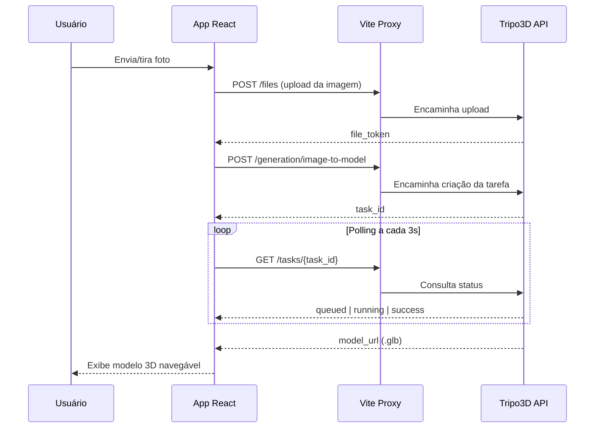

# 📸 Gerador 3D — Fotos para Modelos 3D com IA

<p align="center">
  <b>Aplicação Web que transforma fotografias em modelos 3D navegáveis usando a API da Tripo3D</b>
</p>

<p align="center">
  
  
  
  
  
</p>

---

## 📖 Visão Geral

O **Gerador 3D** é uma aplicação web construída em **React + TypeScript + Vite** que permite ao usuário **enviar fotos do dispositivo** ou **capturá-las diretamente pela câmera** e transformá-las em um **modelo 3D texturizado (.glb)**, navegável em tempo real no próprio navegador.

Por trás dos panos, o app conversa com a **[Tripo3D API](https://developers.tripo3d.com/en/docs/introduction)** (`image-to-model`), que recebe a imagem, processa a reconstrução 3D na nuvem e devolve um arquivo `.glb` pronto para visualização e download.

---

## ✨ Funcionalidades

- 📁 **Upload de imagens** — selecione uma ou mais fotos do dispositivo (até 10MB cada)
- 📷 **Captura pela câmera** — tire a foto direto do navegador, com troca entre câmera frontal/traseira
- 🖼️ **Galeria de pré-visualização** — veja e remova as fotos antes de gerar o modelo
- ⏳ **Acompanhamento de status em tempo real** — enviando → na fila → processando → concluído
- 🧊 **Visualizador 3D interativo** — renderização via `three.js`/`@react-three/fiber`, com controle de órbita (zoom, rotação, pan)
- ⬇️ **Download do modelo** — exporte o `.glb` gerado para usar onde quiser

---

## 🛠️ Stack Tecnológica

| Camada | Tecnologia |
|---|---|
| Framework UI | React 19 + TypeScript |
| Build tool | Vite |
| Renderização 3D | `three` + `@react-three/fiber` + `@react-three/drei` |
| Captura de câmera | `navigator.mediaDevices.getUserMedia` (MediaStream API) |
| Geração 3D (IA) | [Tripo3D API v3](https://developers.tripo3d.com/en/docs/introduction) — `image-to-model` |
| Proxy de desenvolvimento | Vite Server Proxy (contorno de CORS) |

---

## 🔄 Como Funciona (Fluxo de Geração)



1. **Captura** — o usuário envia ou fotografa uma imagem do objeto
2. **Upload** — a imagem é enviada para a Tripo3D (`POST /v3/files`), retornando um `file_token`
3. **Geração** — o app cria uma tarefa de reconstrução (`POST /v3/generation/image-to-model`)
4. **Polling** — o status da tarefa é consultado a cada 3 segundos (`GET /v3/tasks/{task_id}`)
5. **Resultado** — quando concluído, o `.glb` é carregado no visualizador 3D e disponibilizado para download

> ⚠️ **Nota importante:** atualmente o app envia **apenas a primeira foto selecionada** para o endpoint `image-to-model` (que aceita 1 imagem por tarefa). Para combinar múltiplos ângulos (fotogrametria real), é necessário migrar para o endpoint `multiview-to-model`, que aceita até 4 imagens (frente/costas/esquerda/direita).

---

## 🚀 Como Rodar o Projeto

### Pré-requisitos

- [Node.js](https://nodejs.org/) 18+
- Uma chave de API da Tripo3D — [crie a sua aqui](https://developers.tripo3d.com/en/keys)

### Passo a passo

```bash
# 1. Clone o repositório
git clone <url-do-seu-repositorio>
cd gerador-3d

# 2. Instale as dependências
npm install

# 3. Configure as variáveis de ambiente
cp .env.example .env
# edite o .env e cole sua chave da Tripo3D

# 4. Rode em modo desenvolvimento
npm run dev
```

O app estará disponível em `http://localhost:5173`.

---

## ⚙️ Configuração (`.env`)

| Variável | Obrigatória | Descrição |
|---|---|---|
| `VITE_3D_API_KEY` | ✅ Sim | Sua chave de API da Tripo3D |
| `VITE_3D_API_BASE_URL` | ❌ Não | Caminho base da API. Padrão: `/tripo-api/v3`, que é redirecionado pelo proxy do Vite. Só altere se tiver um backend/proxy próprio em produção |

> 🌍 **Atenção ao domínio:** a Tripo3D possui duas plataformas separadas — `openapi.tripo3d.ai` (internacional) e `openapi.tripo3d.com` (China). Uma chave criada em uma **não funciona** na outra (retorna erro 401). O destino do proxy está configurado em `vite.config.ts`.

---

## 🌐 Sobre o Proxy e o CORS

A API da Tripo3D **não envia cabeçalhos CORS** para chamadas feitas diretamente do navegador — a própria documentação deles recomenda uso apenas server-side.

Por isso, este projeto usa o **proxy de desenvolvimento do Vite** (`vite.config.ts`), que repassa as chamadas de `/tripo-api/*` para `https://openapi.tripo3d.ai` a partir do servidor Node, sem esbarrar em CORS.

> 📦 **Para produção:** como o Vite dev server não existe em um build estático, você precisará implementar seu próprio backend/serverless function que faça esse mesmo repasse (proxy reverso) para a Tripo3D antes de fazer o deploy.

---

## 📂 Estrutura do Projeto

```
gerador-3d/
├── src/
│   ├── components/
│   │   ├── ImageUploader.tsx     # Upload de imagens do dispositivo
│   │   ├── CameraCapture.tsx     # Captura de foto pela câmera
│   │   └── ModelViewer.tsx       # Visualizador 3D (three.js)
│   ├── hooks/
│   │   ├── useCamera.ts          # Controle de MediaStream da câmera
│   │   └── useModelGeneration.ts # Orquestração do fluxo de geração + polling
│   ├── services/
│   │   └── api3d.ts              # Integração com a Tripo3D API
│   ├── types/
│   │   └── index.ts              # Tipos compartilhados (CapturedImage)
│   └── App.tsx                   # Composição da UI principal
├── vite.config.ts                # Proxy de desenvolvimento (contorno CORS)
└── .env.example                  # Modelo de variáveis de ambiente
```

---

## 🧭 Roadmap / Possíveis Melhorias

- [ ] Migrar para o endpoint `multiview-to-model` para usar múltiplos ângulos de foto
- [ ] Implementar backend/serverless function de proxy para produção
- [ ] Adicionar barra de progresso real (`progress`) durante o processamento
- [ ] Cache/histórico de modelos gerados na sessão
- [ ] Testes automatizados (unitários e E2E)

---

## 📜 Licença

Este projeto é de uso livre para fins de estudo e experimentação. Ajuste conforme a licença do seu repositório.

---

<p align="center">Feito com ⚛️ React, 🎲 Three.js e ✨ Tripo3D API</p>
